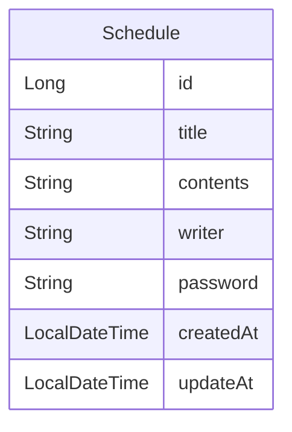

# 🗓️ Schedule API

간단한 일정 관리 API입니다.  
일정 생성, 조회(전체/작성자별), 단건 조회, 수정, 삭제 기능을 제공합니다.

---

## 🧩 ERD (Entity Relationship Diagram)



---

## 🛠️ API 명세서

### POST /schedules - 일정 생성

- **설명**: 새로운 일정을 생성합니다.
- **요청 본문** (`application/json`):

```json
{
  "title": "제목",
  "contents": "내용",
  "writer": "작성자",
  "password": "비번"
}
```

### GET /schedules?writer=작성자 - 일정 조회 (전체 또는 작성자별)

- **설명**:  
  전체 일정을 조회하거나, 특정 작성자의 일정만 필터링해서 조회합니다.

- **쿼리 파라미터 (선택)**:
    - `writer` (optional): 작성자 이름
        - 이 값을 입력하면 해당 작성자의 일정만 조회
        - 생략하면 전체 일정 조회

### GET /schedules/{id} - 일정 단건 조회

- **설명**:  
  ID를 기준으로 하나의 일정을 조회합니다.

### PATCH /schedules/{id} - 일정 수정

- **설명**:  
  비밀번호를 검증한 후 일정을 수정합니다. (제목과 작성자만 수정 가능)

- **요청 본문** (`application/json`):

```json
{
  "title": "수정된 제목",
  "writer": "작성자",
  "password": "비밀번호"
}
```

### DELETE /schedules/{id} - 일정 삭제

- **설명**:  
  비밀번호를 입력해 해당 일정을 삭제합니다.
- **요청 본문** (`application/json`):

```json
{
  "password": "비밀번호"
}
```

